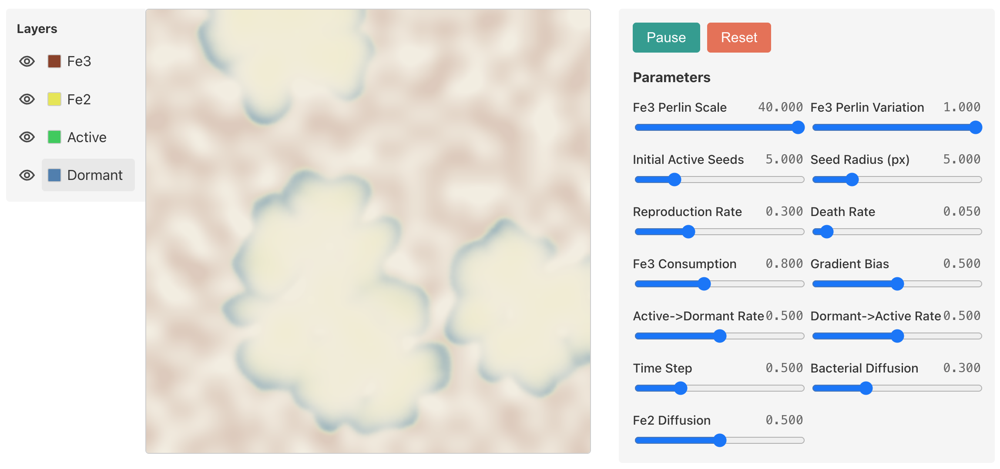
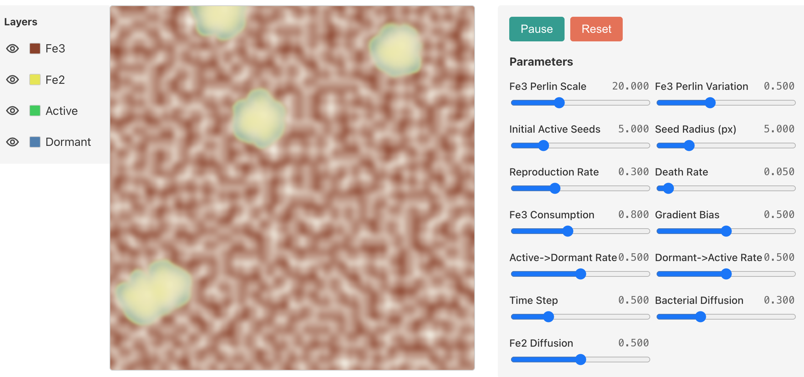

# Geobacter Simulation

A WebGL-based reaction-diffusion simulation of *Geobacter metallireducens* bacterial colonies, motivated by the search for life on Mars. [Live App Demo](https://travisformayor.github.io/geobacter-sim/)




## Overview

This application simulates the emergent formation of "leopard spot" patterns observed in the Jezero Crater on Mars. It models the lifecycle of bacteria as they consume iron minerals (Fe<sup>3+</sup>), produce waste (Fe<sup>2+</sup>), reproduce, and migrate towards food sources.

<p align="center">
  <br>
  <small><em>Mars 'Leopard Spots' in Jezero Crater. Credit: NASA/JPL-Caltech/MSSS</em></small>
</p>

The simulation runs entirely on the GPU using GLSL shaders to solve a system of differential equations in real-time.

## User Guide

<p align="center">
    
    
</p>

The main canvas shows the bacterial colony evolving in real-time. Hovering over different layers in the top right allows you to inspect individual density fields.
*   **Red/Rust**: Food (Ferric Iron / Fe<sup>3+</sup>).
*   **Yellow**: Waste (Ferrous Iron / Fe<sup>2+</sup>).
*   **Green**: Active bacteria.
*   **Blue**: Dormant bacteria.

#### Simulation Parameters

*   **Fe3 Perlin Scale**: Controls the scale of the initial food resource pattern.
*   **Fe3 Perlin Variation**: Controls the intensity/variation of the initial food resources.
*   **Initial Active Seeds**: Number of starting bacterial colonies.
*   **Seed Radius**: Size of the initial bacterial colonies.
*   **Reproduction Rate**: How fast bacteria divide.
*   **Death Rate**: How fast bacteria die naturally.
*   **Fe3 Consumption**: How fast bacteria consume resources.
*   **Gradient Bias**: Strength of movement towards food.
*   **Active-&gt;Dormant Rate**: Rate at which active bacteria go dormant when food is scarce.
*   **Dormant-&gt;Active Rate**: Rate at which dormant bacteria reactivate when food is found.
*   **Time Step**: Simulation speed.
*   **Bacterial Diffusion**: Random movement representing water turbulence.
*   **Fe2 Diffusion**: How fast waste products diffuse.

## Technical Details

This project is built with:
*   **Vite + Svelte**: Frontend framework.
*   **Three.js**: WebGL rendering engine.
*   **GLSL**: Shader running a system of ODEs for simulation (`src/shaders/compute.frag`).

### Mathematical Models

The simulation defines spatial density fields for **Food** ($F_3$), **Waste** ($F_2$), **Active Bacteria** ($A$), and **Dormant Bacteria** ($D$). These fields change over time according to this flow diagram:

<p align="center">
    
</p>

The flow diagram can be modeled mathematically with the following system of Ordinary Differential Equations (ODEs):

$$
\begin{aligned}
\frac{dF_3}{dt} &= -r_c A F_3 \\
\frac{dF_2}{dt} &= +r_w A F_3 \\
\frac{dA}{dt} &= (r_r - r_d - r_{ad}(F_3)) A + r_{da}(F_3) D \\
\frac{dD}{dt} &= r_{ad}(F_3) A - (r_{da}(F_3) + r_d) D
\end{aligned}
$$

The stage transition functions scale linearly based on available resources:

$$
\begin{aligned}
r_{ad}(F_3) &= \alpha_{ad}\left(1 - \frac{F_3}{K_F}\right) \\
r_{da}(F_3) &= \alpha_{da}\left(\frac{F_3}{K_F}\right)
\end{aligned}
$$

### Project Structure

```
geobacter-sim/
├── src/
│   ├── components/                 # Svelte UI
│   │   ├── ControlPanel.svelte     # Parameter sliders
│   │   ├── InfoPanel.svelte        # Information section
│   │   ├── LayerControls.svelte    # Toggle the visibility of each layer
│   │   └── SimulationCanvas.svelte # Simulation canvas area
│   │
│   ├── shaders/                    # GLSL simulation code
│   │   ├── compute.frag            # ODE Models, Movement, and Diffusion
│   │   └── display.frag            # Visualization color gradients
│   │
│   └── simulation/                 # Non-GPU simulation code
│       ├── parameters.ts           # Parameter defaults
│       └── Simulation.ts           # GPU setup and lifecycle
```

### Local Development

```bash
# Install dependencies
npm install

# Run dev server
npm run dev

# Build for production
npm run build
```

### Future Work

*   **Custom Layer Colors**: Allow users to define their own colors for the different simulation layers.
*   **Parameter Presets**: A preset example buttons that load different initial parameter configurations.

### Credits

*   **[reaction-diffusion-playground](https://github.com/jasonwebb/reaction-diffusion-playground)** by Jason Webb
*   **[GPUComputationRenderer](https://threejs.org/examples/?q=gpgpu#webgl_gpgpu_birds)** (Three.js examples)
*   **[The Book of Shaders](https://thebookofshaders.com/11/)** (Random functions)
