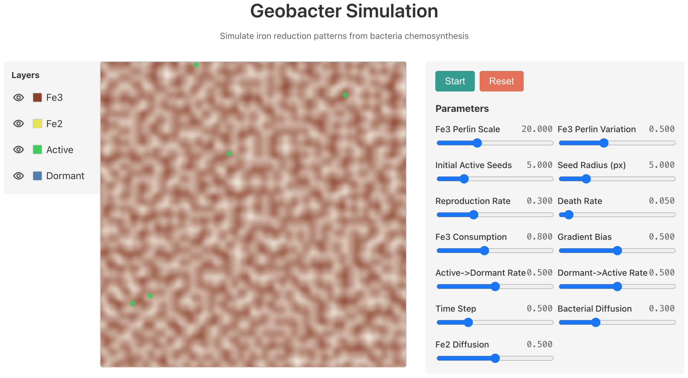
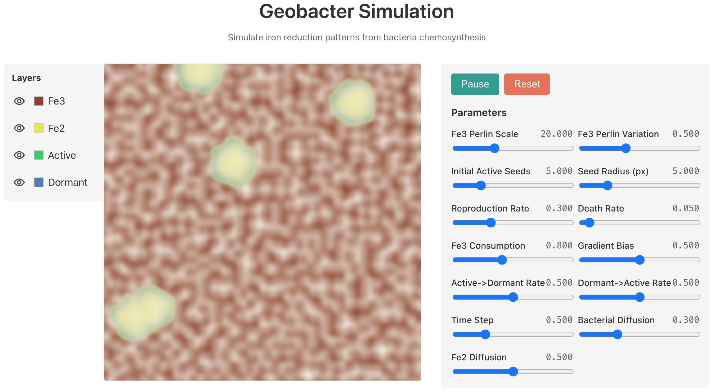
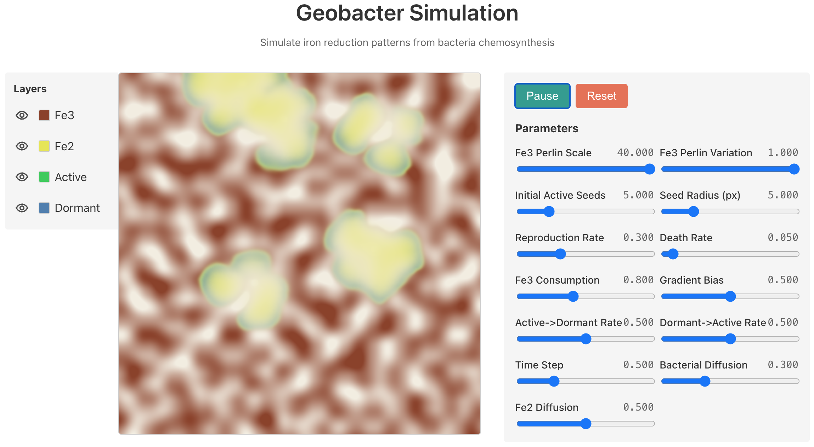
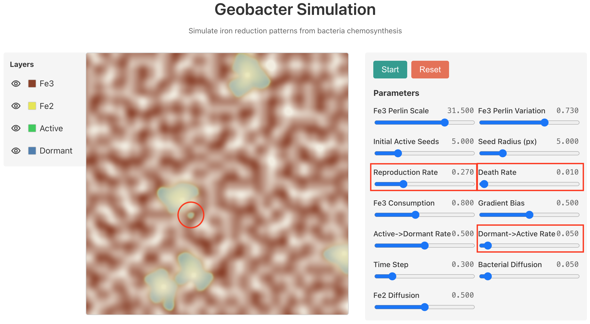

<style>
  :root, html, body {
    font-size: 10pt !important;
    line-height: 1.3 !important;
  }

  figure.centered-image { 
    text-align: center; 
    margin: 0 auto; 
  }
  figure.centered-image img { 
    display: block; 
    margin: 0 auto; 
    max-width: 90%; 
    height: auto;
    border: 1px solid #ddd;
    border-radius: 4px;
  }
  figure.centered-image figcaption { 
    color: #555; 
    margin-top: 2px; 
    margin-bottom: 4px; 
    font-size: 0.9em;
    font-style: italic;
  }
  .math-block {
    overflow-x: auto;
    margin: 1em 0;
    padding: 0.5em;
    background-color: #f9f9f9;
    border-radius: 4px;
  }
  /* For PDF typesetting */
  body {
    font-family: "Times New Roman", Times, serif;
  }
  h1, h2, h3, h4, h5 {
    font-family: Arial, sans-serif;
    color: #333;
  }
  code {
    background-color: #f4f4f4;
    padding: 2px 4px;
    border-radius: 3px;
    font-family: "Courier New", Courier, monospace;
    font-size: 0.9em;
  }
</style>

<h2 style="margin-bottom:-20px; text-align:center;">Project Report: Emergent Patterns from Bacteria Models</h2>

<h4 style="margin-bottom:0px; text-align:center;">Travis Uhrig</h4>

### Introduction

#### The Mars Jezero Crater 'Leopard Spots'

In March of 2025, NASA announced that the Mars Perseverance rover had observed patterns in fossilized mudstone at the Jezero Crater, a location once likely filled with liquid water. Dubbed 'leopard spots', these patterns contain light interiors and darker rims (Witze, 2025). A follow-up paper published September 2025 found that the millimeter-scale spots are rich in iron-containing minerals, likely vivianite and greigite, and formed by "reaction fronts" of iron reduction spreading outward from a center point (Hurowitz et al., 2025). 

The Jezero Crater's low-temperature past rules out known non-biological causes for these reactions, but we are not currently able to confirm a biological cause either (Hurowitz et al., 2025). However, bacteria capable of creating similar iron reduction patterns do exist on Earth, making the Jezero Crater discovery possibly the strongest sign of extraterrestrial life we currently have. This news inspired this project, to understand how Earth bacteria create these same kind of patterns and to learn how a hypothetical Martian organism could have worked.

<figure class="centered-image">
  
  <figcaption>
    Fig 1. Mars 'Leopard Spots' in Jezero Crater.
    <br>
    <small>Credit: NASA/JPL-Caltech/MSSS</small>
  </figcaption>
</figure>

#### *Geobacter metallireducens*

*Geobacter* are a genus of bacteria that can live off the energy released by chemical reactions involving inorganic compounds (like those found in minerals), a process known as *chemosynthesis* (Geobacter, n.d.; Chemosynthesis, n.d.). As *Geobacter* bacteria deplete local resources and propagate outward, they create a chemical reaction front, which over time creates a pattern in the inorganic medium. This pattern is not directly found in any single bacterium’s lifecycle but instead exists as an *emergent property* from the interaction between the population and the environment.

<figure class="centered-image">
  
  <figcaption>
    Fig 2. Geobacter reduction spots.
    <br>
    <small>Credits: (a) Fox et al. (2019), (b) Andeskie et al. (2018), (c) Spinks et al. (2014), (d) McMahon et al. (2018)</small>
  </figcaption>
</figure>

One species, *Geobacter metallireducens*, has many of the characteristics that a hypothetical Martian organism would need in order to create the 'leopard spots' pattern observed in the Jezero Crater (Lovley et al., 1993):
1.  It is an anaerobic bacteria found in lake mud.
2.  It reduces ferric iron (Fe<sup>3+</sup>), a form of iron commonly found in minerals, into ferrous iron (Fe<sup>2+</sup>) (*Geobacter metallireducens*, n.d.). This Fe<sup>2+</sup> can then react with other elements to make the same vivianite and greigite minerals likely found in the Jezero Crater.
3.  It can move towards increasing concentrations of Fe<sup>3+</sup>.

#### Research Questions

Simple organisms following simple rules can create complex emergent patterns when populations interact with the right environment. My project uses multi-variable continuous-time Ordinary Differential Equations (ODEs) to model the lifecycle of a simplified version of *Geobacter metallireducens* in a population density field to see if, in the right conditions, I can reproduce the emergent iron reduction patterns seen on Mars.

**Live Simulation**: The interactive simulation can be viewed at [https://travisformayor.github.io/geobacter-sim/](https://travisformayor.github.io/geobacter-sim/)

### Methods

#### Mathematical Model

The model tracks four density fields:
1.  **Fe<sup>3+</sup> (Food):** The resource gradient, initially generated with a Perlin noise field.
2.  **Fe<sup>2+</sup> (Waste):** The byproduct gradient, diffused locally as it is generated.
3.  **Active Bacteria (A):** The active population consuming Fe<sup>3+</sup>, producing Fe<sup>2+</sup>, replicating, and moving.
4.  **Dormant Bacteria (D):** The inactive population that can reactivate when Fe<sup>3+</sup> levels improve.

<figure class="centered-image">
  
  <figcaption>
    Fig 3. <em>Geobacter metallireducens</em> flow diagram used to derive the ODE system.
  </figcaption>
</figure>

##### ODE System
Each density field is represented by the following system of ODEs:

\[
\begin{aligned}
\frac{dF_3}{dt} &= -\,r_c\,A\,F_3 \\[6pt]
\frac{dF_2}{dt} &= +\,r_w\,A\,F_3 \\[6pt]
\frac{dA}{dt} &= (r_r - r_d - r_{ad}(F_3))\,A + r_{da}(F_3)\,D \\[6pt]
\frac{dD}{dt} &= r_{ad}(F_3)\,A - (r_{da}(F_3) + r_d)\,D
\end{aligned}
\]

Stage transition functions \(r_{ad}\) (Active to Dormant) and \(r_{da}\) (Dormant to Active) scale linearly with available \(F_3\) resources:
\[
r_{ad}(F_3) = \alpha_{ad}\left(1 - \frac{F_3}{K_F}\right) \\[1em]
r_{da}(F_3) = \alpha_{da}\,\frac{F_3}{K_F}
\]

#### Simulation Technical Implementation

For the simulation I used a 2D shader to create an array of pixels that represent a mudstone medium, and then tracked four state variables over time in each pixel. Using a shader was purely for performance. By using the RGBA channels as storage for the state variables, you can calculate the ODEs for each pixel in parallel and update the simulation in real-time. Each state variable stores a value between 0 and 1, representing the density of that variable in the pixel. I could then map those values to any color gradient I wanted to visualize the population or resource density.

##### Graphics Pipeline

I created a web application using Three.js to handle the shader pipeline, with GLSL (OpenGL Shading Language) code based on examples from the [Reaction-Diffusion-Playground](https://github.com/jasonwebb/reaction-diffusion-playground) (Webb, n.d.). The pipeline uses the "ping-pong" buffer technique, with two texture files that contain the RGBA state variables for each pixel. You then read from one texture while creating the next frame in the other texture, then swapping texture roles for the next frame, and so on. I used the following channels for each pixel:
*   **Red Channel:** Fe<sup>3+</sup> Concentration
*   **Green Channel:** Fe<sup>2+</sup> Concentration
*   **Blue Channel:** Dormant Density
*   **Alpha Channel:** Active Density

##### Movement and Diffusion
I modeled spatial movement in the shader pipeline with simple random walk and diffusion functions:
1.  **Active Movement:** Active bacteria perform a biased random walk, following the local gradient of the Fe<sup>3+</sup> field, by biasing the diffusion of the Alpha channel (Active bacteria) towards the gradient.
2.  **Dormant Movement:** Dormant bacteria diffuse with simple random walk, with a random bias to represent turbulent water in a pore medium.
3.  **Waste Diffusion:** Fe<sup>2+</sup> diffuses locally using a 3x3 Gaussian kernel (Agate Dragon, 2024).

### Results

The simulation successfully produced spot-like patterns resembling those observed in the Jezero Crater and Earth based examples.

#### Initial Conditions
I initialized the simulation with a randomized Perlin noise field for Fe<sup>3+</sup> (to simulate natural mineral heterogeneity) and placed random "seed" patches of active bacteria.

<figure class="centered-image">
  
  <figcaption>
    Fig 4. Initial state. Rust colored areas indicate high Fe<sup>3+</sup> concentration. Green dots are initial bacterial seed colonies.
  </figcaption>
</figure>

#### Spot Formation
As the simulation progressed, I observed the formation of expanding reaction fronts. The bacteria locally depleted the Fe<sup>3+</sup>, creating an interior zone devoid of resources. This forced the active population to move outward following the nutrient gradient.

The interior of these spots contained no living bacteria (due to starvation), while the rim consisted of a mix of active and dormant bacteria. This matches the description of "leopard spots" with light interiors and dark rims (caused by different in-process and waste minerals in the reaction front).

##### Different Fe<sup>3+</sup> Distributions

*   **Mixed/Homogeneous Fe<sup>3+</sup>:** Resulted in circular, uniform colonies (Fig 5a).
*   **Banded Fe<sup>3+</sup>:** Resulted in irregular, elongated colonies that followed the resource bands (Fig 5b), demonstrating that the bacteria were truly following the gradient rather than simply expanding radially.

<figure class="centered-image">
  
  
  <figcaption>
    Fig 5a. (Left) Circular colonies forming in homogeneous resources. Fig 5b. (Right) Irregular colonies following nutrient bands.
  </figcaption>
</figure>

##### Satellite Colony Formation
Initially, I did not see new colonies forming as expected. Instead, dormant bacteria would die off or get swept up in the expanding front. When I asked myself what could help dormant bacteria escape existing colonies, I wondered if I could slow the reaction front by lowering the reproduction rate, and allow dormant bacteria to travel further by lowering the death rate and dormant-to-active transition rate. Once I adjusted these parameters I was able to consistently observe new "satellite" colonies forming (Fig 6).

<figure class="centered-image">
  
  <figcaption>
    Fig 6. Formation of a new colony (indicated by the red circle)
    <br>
    <small>Simulation used a lower reproduction rate, lower death rate, and lower dormant-to-active transition rate.</small>
  </figcaption>
</figure>

Seeing these new colonies form was the final piece of behavior that I was hoping to see replicated in my simulation.

### Discussion

#### Confirmation of Emergent Behavior
I was able to confirm the formation of macroscopic "leopard spot" patterns solely from the interaction of microscopic life-cycle rules. I wrote no code that explicitly instructed the bacteria to form spots, rings, or new colonies, but was able to observe all three as a result of the following interactions:
1.  Resource Depletion
2.  Nutrient Gradient
3.  Mobility and Reproduction

#### Lack of Steady State
I observed that the system does not reach a stable steady state. The bacteria either:
1.  **Collapse:** If consumption is too high or reproduction is too low, the colony consumes all local food before it can spread, and then all bacteria die off.
2.  **Unbounded Growth:** For any other state besides colony collapse, the bacteria will continue to expand until the entire domain is depleted of Fe<sup>3+</sup>, and then all bacteria die off.

Because of this, the observed spots in the Mars and Earth examples either show snapshots of a moment in time, captured when the water dried up and the mudstone fossilized, or show patterns resulting from much lower or more distinct areas of Fe<sup>3+</sup> concentration that were fully depleted.

---

### References

**Literature References**

Chemosynthesis. (n.d.). Wikipedia. Retrieved October 26, 2025, from https://en.wikipedia.org/wiki/Chemosynthesis

Geobacter. (n.d.). Wikipedia. Retrieved October 26, 2025, from https://en.wikipedia.org/wiki/Geobacter

Geobacter metallireducens. (n.d.). Wikipedia. Retrieved October 26, 2025, from https://en.wikipedia.org/wiki/Geobacter_metallireducens

Hurowitz, J. A., Tice, M. M., Allwood, A. C., et al. (2025). Redox-driven mineral and organic associations in Jezero Crater, Mars. Nature, 645, 332–340. https://doi.org/10.1038/s41586-025-09413-0

Lovley, D. R., Giovannoni, S. J., White, D. C., et al. (1993). Geobacter metallireducens gen. nov. sp. nov., a microorganism capable of coupling the complete oxidation of organic compounds to the reduction of iron and other metals. Archives of Microbiology, 159, 336–344. https://doi.org/10.1007/BF00290916

Witze, A. (2025, March 12). Did Mars harbour life? One of the strongest signs yet is spotted in a peculiar rock. Nature. https://doi.org/10.1038/d41586-025-00772-2

**Technical References**

Agate Dragon. (2024). *Simple Gaussian Blur*. Retrieved from https://agatedragon.blog/2024/01/09/simple-gaussian-blur/

Gonzalez Vivo, P., & Lowe, J. (n.d.). *The Book of Shaders*. Retrieved from https://thebookofshaders.com/

Three.js Authors. (n.d.). *GPUComputationRenderer* [Source code]. Retrieved from https://threejs.org/examples/?q=gpgpu#webgl_gpgpu_birds

Webb, J. (n.d.). *Reaction-Diffusion Playground* [Source code]. GitHub. Retrieved from https://github.com/jasonwebb/reaction-diffusion-playground

**Geobacter Image References**

Andeskie, A. S., Benison, K., Eichenlaub, L., & Raine, R. (2018). Acid-saline-lake systems of the Triassic Mercia Mudstone Group, County Antrim, Northern Ireland. Journal of Sedimentary Research, 88(4), 385–398. https://doi.org/10.2110/jsr.2018.14

Fox, D., Spinks, S., Thorne, R., Barham, M., et al. (2019). Mineralogy and geochemistry of atypical reduction spheroids from the Tumblagooda Sandstone, Western Australia. Sedimentology, 67(3), 1332–1353. https://doi.org/10.1111/sed.12659

McMahon, S., Hood, A., Parnell, J., & Bowden, S. (2018). Reduction spheroids preserve a uranium isotope record of the ancient deep continental biosphere. Nature Communications, 9, 4505. https://doi.org/10.1038/s41467-018-06974-9

Spinks, S., Parnell, J., & Still, J. (2014). Redox-controlled selenide mineralization in the Upper Old Red Sandstone. Scottish Journal of Geology, 50(2), 173–182. https://doi.org/10.1144/sjg2013-014

---

### Appendix

#### Project Structure

The codebase consists of a Svelte UI and a GLSL (OpenGL Shading Language) simulation. The app runs entirely client-side in the browser, with no server backend needed. 

You can try it out at [https://travisformayor.github.io/geobacter-sim/](https://travisformayor.github.io/geobacter-sim/), or inspect the source code on GitHub: [https://github.com/travisformayor/geobacter-sim](https://github.com/travisformayor/geobacter-sim)

##### Key Files Structure

```
geobacter-sim/
├── src/
│   ├── components/                 # Svelte UI
│   │   ├── ControlPanel.svelte     # Parameter sliders
│   │   ├── InfoPanel.svelte        # Information section
│   │   ├── LayerControls.svelte    # Toggle the visibility of each layer
│   │   └── SimulationCanvas.svelte # Simulation canvas area
│   │
│   ├── shaders/                    # GLSL simulation code
│   │   ├── compute.frag            # ODE Models, Movement, and Diffusion
│   │   └── display.frag            # Visualization color gradients
│   │
│   └── simulation/                 # Non-GPU simulation code
│       ├── parameters.ts           # Parameter defaults
│       └── Simulation.ts           # GPU setup and lifecycle
```
